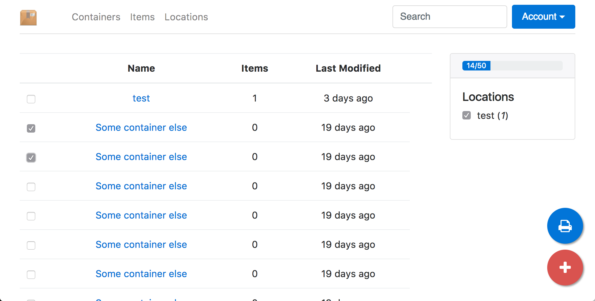

# Boxmeup UI

This projcet houses the UI source for the new Boxmeup Go-lang implementation. The goal of this project is to create a single-page app that is
mobile and offline (sortof) friendly that operates on the new Boxmeup Go server API.




## Setup

```bash
npm install
npm start
```

This will run a local version of the UI hosted via a node application (`react-scripts`) This will serve up the static pages only,
the app will then interact on a server API on port `8080` (see below).

### Server Setup

You will need [Boxmeup Go server](https://github.com/cjsaylor/boxmeup-go) running on port `8080`. See that project for setup details.
